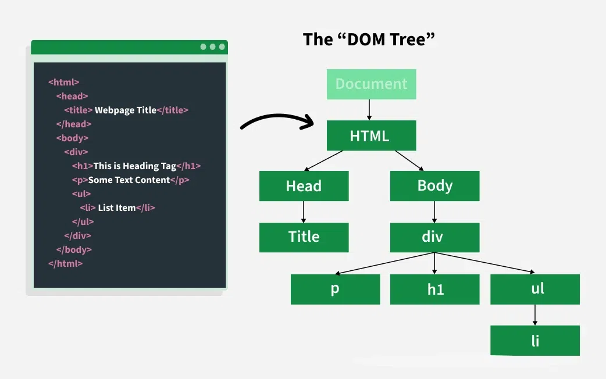
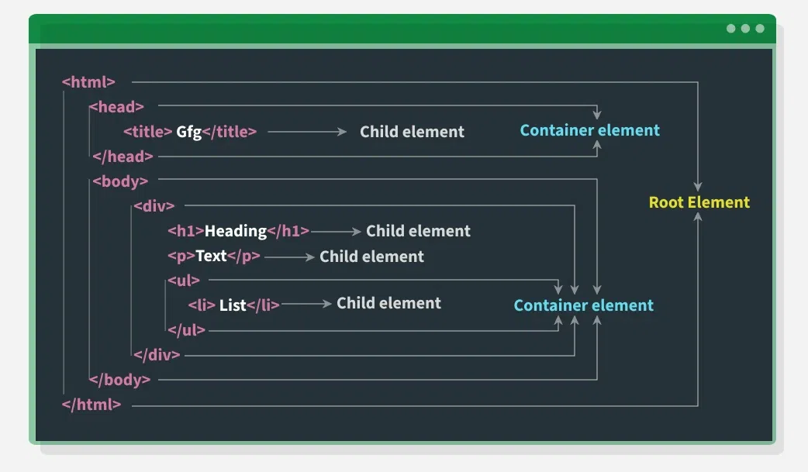

## JavaScript HTML DOM (Document Object Model)
- ##### The JavaScript HTML `DOM` is a way for JavaScript to interact with the content of a webpage.
- ##### It shows the HTML of the page as a tree of objects (like a family tree), making it easy to change things on the page without reloading it.
- ##### By manipulating the DOM, you can update the content, structure, and styling of a page without requiring a page reload.
  

### What is JavaScript HTML DOM?
- ###### The DOM (Document Object Model) is a system that lets JavaScript read and change the content, structure, and style of a webpage.
- ###### It turns every HTML element (like headings, paragraphs, buttons, etc.) into objects that JavaScript can work with.
- ###### With the DOM, you can add, remove, or change elements on the page dynamically (while the page is open).
---
### Main Features of the JavaScript DOM
- ##### Tree Structure:
    - The DOM is like a `family tree`. Some elements are parents, and others are children. This makes it easier to find and work with specific parts of the page.

- ##### Element Access:
  - JavaScript gives you tools to find and use these elements. Some common methods are:
    - `getElementById()` – finds an element by its ID.
    - `getElementsByTagName()` – finds all elements with a certain tag name.
    - `querySelector()` – finds the first element that matches a CSS selector.
---

<!-- Dom Tree -->
#### DOM Tree Visualization ↓


----




---
#### Example
- ##### This example shows the accessing the JavaScript HTML DOM by id.
```javascript
<html>
<head></head>

<body>
    <h1 id="demo">This is some text.</h1>
    <button onclick="changeText()">
      Change Text
      </button>

    <script>
        function changeText() {
            let element = document.getElementById("demo");
            element.textContent = "Text changed by JavaScript!";
        }
    </script>
</body>

</html>
```

---

### Accessing Elements in the DOM

- #### `getElementById()`
    - Retrieves an element by its id.
```javascript
let heading = document.getElementById("title");
console.log(heading.textContent);
```

- #### `getElementsByClassName()`
    - Returns a collection of elements with a specified class.
```javascript
let items = document.getElementsByClassName("list-item");
console.log(items[0].textContent);
```

- #### `getElementsByTagName()`
   - Selects elements by their < Tag > name.
```javascript
let paragraphs = document.getElementsByTagName("p");
console.log(paragraphs.length);
```

- #### `querySelector()`
  - Returns the first element matching a CSS selector(either `.class` or `#id`).
```javascript
let firstParagraph = document.querySelector("p");
console.log(firstParagraph.textContent);
```

- #### `querySelectorAll()`
  - Returns all elements matching a CSS selector(either `.class` or `#id`).
```javascript
let allParagraphs = document.querySelectorAll("p");
allParagraphs.forEach(p => console.log(p.textContent));
```

---

### Modifying the DOM

- #### Changing Content
  - You can modify the content of an element using `textContent` or `innerHTML` or `innerText`.
```javascript
document.getElementById("title").textContent = "New Heading";
document.getElementById("content").innerHTML = "<b>Updated Content</b>";
document.getElementbyId('btn').innerText = "Hello";
```

  - #### The Differences Between `innerHTML`, `innerText` and `textContent` :
```javascript
<p id="myP">   This element has extra spacing     and contains <span>a span element</span>.</p>

<script>
    let text = document.getElementById("myP").innerText;

    let text = document.getElementById("myP").innerHTML;

    let text = document.getElementById("demo").textContent;
</script>
```
```
In the example above:

The 'innerText' property returns:
This element has extra spacing and contains a span element.

The 'innerHTML' property returns:
   This element has extra spacing    and contains <span>a span element</span>.
   
The 'textContent' property returns:
   This element has extra spacing    and contains a span element.
```
  - ***Note***
```
The innerHTML property returns:
The text content of the element, including all spacing and inner HTML tags.

The innerText property returns:
Just the text content of the element and all its children, without CSS hidden text spacing and tags, except <script> and <style> elements.

The textContent property returns:
The text content of the element and all descendaces, with spacing and CSS hidden text, but without tags.
```

- #### Changing Attributes
  - You can modify attributes like src, href, alt, etc.
```javascript
document.getElementById("myImage").src = "new-image.jpg";
```
---
## Adding and Removing Elements
- #### Create an element:
```javascript
let newPara = document.createElement("p");
newPara.textContent = "This is a new paragraph.";
document.body.appendChild(newPara);
```

- #### Remove an element
```javascript
let oldPara = document.getElementById("removeMe");
oldPara.remove();
```
---
## Event Handling in the DOM
- JavaScript allows us to handle events such as clicks, keypresses, mouse movements, etc.

- #### Adding an Event Listener
```javascript
document.getElementById("btn").addEventListener("click", function() { 
   alert("Button Clicked!");
});
```

- #### Event Object
  - The event object provides details about the event.
```javascript
document.getElementById("inputField").addEventListener("keyup", function(event) {
   console.log("Key pressed: ", event.key);
});
```

---

## ***Advantages of Using the DOM with JavaScript***

- ###### `Interactivity`: With the help of the JavaScript and DOM website can be interactive and dyanmic.

- ###### `Real-time Updates`: With the help of the JavaScript without refreshing we can update the content of the page, which makes the user experience faster.

- ###### `User Input Handling`: The DOM allows us to handle the user inputs in the forms due to which with the backend services there is the seamless communication.


