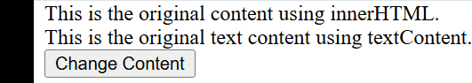
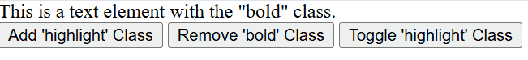

# DOM Manipulation
#### We can manipulate or change the `DOM` elements by using the following methods:

- ### 1. Change the Content of an Element
  - ###### You can change the content inside an HTML element using `DOM` in JS.
  - ###### The two most common properties for this are `innerHTML` and `textContent`:
    - `innerHTML` - Allows you to get or set the HTML content inside an element.
    - `textContent`: Allows you to get or set the text content inside an element, ignoring any HTML tags.
```javascript
<body>
    <div id="example1">This is the original content using innerHTML.</div>
    <div id="example2">This is the original text content using textContent.</div>

    <button onclick="changeContent()">Change Content</button>

    <script>
        // Function to change content
        function changeContent() {
            document.getElementById("example1").innerHTML = 
            "<strong>This is changed using innerHTML!</strong>";

            document.getElementById("example2").textContent = 
            "This is changed using textContent!";
        }
    </script>
</body>
```

### Output:


```
In this example

    `innerHTML` changes the entire content of an element, including HTML tags. In this case, we replace the content of the first div with bold text using <strong>.

    `textContent` changes only the text inside the element, ignoring any HTML tags. The second div is updated with plain text, without any HTML formatting.
```

---

- ### 2. Manipulate the Class Attribute
  - You can add, remove, or toggle classes on an element using JavaScript. 
  - This is helpful for styling or applying animations.
  - `classList.add()`: Adds a class to an element.
  - `classList.remove()`: Removes a class from an element.
  - `classList.toggle()`: Toggles a class (adds it if it's not present, removes it if it is).
```javascript
<html>
<head>
    <style>
        .highlight {
            color: red;
            font-weight: bold;
        }
        .bold {
            font-weight: bold;
        }
    </style>
</head>
<body>
    <div id="example" class="bold">This is a text element with the "bold" class.</div>

    <button onclick="addClass()">Add 'highlight' Class</button>
    <button onclick="removeClass()">Remove 'bold' Class</button>
    <button onclick="toggleClass()">Toggle 'highlight' Class</button>
    <script>
        function addClass() {
            document.getElementById("example").classList.add("highlight");
        }
        function removeClass() {
            document.getElementById("example").classList.remove("bold");
        }
        function toggleClass() {
            document.getElementById("example").classList.toggle("highlight");
        }
    </script>
</body>
</html>
```

### Output:


```
In this example:
    Adding a Class (addClass()): When you click the "Add 'highlight' Class" button,
    the highlight class is added to the div element with the id="example".
    This changes the text color to red and makes it bold (as defined in the CSS).

    Removing a Class (removeClass()): When you click the "Remove 'bold' Class" button, 
    the bold class is removed from the div, which removes the bold styling from the text.

    Toggling a Class (toggleClass()): When you click the "Toggle 'highlight' Class" button,
    the highlight class is either added or removed, depending on whether it's already present. 
    If the class is present, it will be removed; if not, it will be added.
```

---

- ### 3. Set CSS Styles Using JavaScript
  - You can directly manipulate the CSS `styles` of an element using the style property. 
  - This allows you to dynamically change how elements appear on the page.


