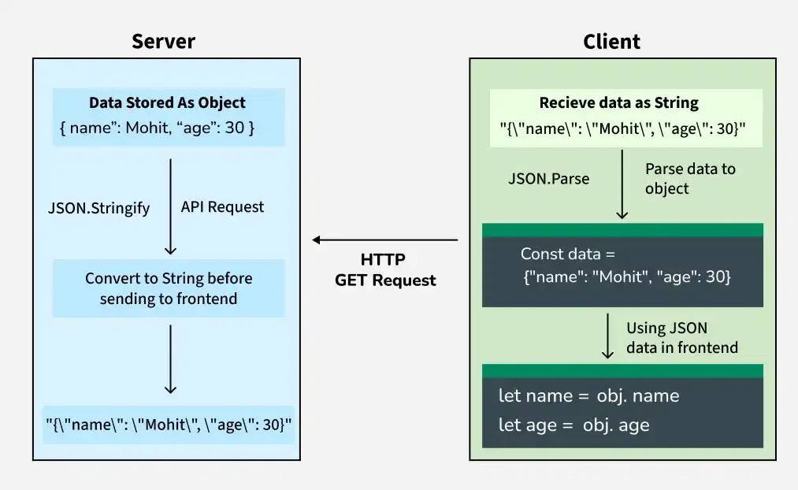

## JSON Introduction
- ##### JSON stands for JavaScript Object Notation.

- ##### JSON is a is a widely-used, lightweight data format for representing structured data
  
- #####  It is used extensively in APIs, configuration files, and data exchange between servers and clients.

- ##### JSON is widely used to transmit data between a server and a client as part of a web API response.
  
- ##### It is easy to read and write for humans and machines alike, which makes it a preferred choice for data interchange in web applications.

---

### JSON Data Flow: From Server to Client


---

### Key Characteristics of JSON
- ##### Text-based: Easy to transmit as plain text.

- ##### Human-readable: Uses clear key-value pair and array structures.

- ##### Language-independent: Supported by most programming languages (e.g., JavaScript, Python, Java, PHP).

- ##### Data types: Supports strings, numbers, booleans, arrays, objects, and null.


---

### JSON Data Flow in Web Applications

- #### Server-side:
  - ##### Data is stored as objects (e.g., in a database or application logic).
  - ##### Converted to a JSON string using methods like `JSON.stringify()` (JavaScript) or` json.dumps()` (Python).
  - ##### Sent to the client via an HTTP response (e.g., API endpoint).
- #### Client-side:
  - ##### The JSON string is received (e.g., via an HTTP GET request).
  - ##### Parsed into a native object using `JSON.parse()` (JavaScript) or `json.loads()` (Python).
  - ##### Used in the application logic or UI.

#### Example(JavaScript)
```js
// Received JSON string
const jsonString = '{"name": "Mohit", "age": 30}';

// Parse to object
const obj = JSON.parse(jsonString);

// Access properties
console.log(`Name: ${obj.name}, Age: ${obj.age}`);
// Output: Name: Mohit, Age: 30
```

----

## Working with JSON in Different Languages
- #### Javascript
  - ##### Parsing JSON: Use `JSON.parse()`.
  - ##### Serializing to JSON: Use `JSON.stringify()`.
  - ##### Error Handling: Always wrap `JSON.parse()` in a try-catch to handle invalid JSON.
```js
try {
    const jsonString = '{"name": "Mohit", "age": 30}';
    const obj = JSON.parse(jsonString);
    console.log(obj.name); // Output: Mohit
} catch (error) {
    console.error("Invalid JSON:", error.message);
}

const obj = { name: "Mohit", age: 30 };
const jsonString = JSON.stringify(obj);
console.log(jsonString); // Output: {"name":"Mohit","age":30}
```

- #### Python
  - ##### Parsing JSON: Use `json.loads()`.
  - ##### Serializing to JSON: Use `json.dumps()`.
  - ##### Error Handling: Handle `json.JSONDecodeError` for invalid JSON.
```python
import json

try:
    json_str = '{"name": "Mohit", "age": 30}'
    data = json.loads(json_str)
    print(data["name"])  # Output: Mohit
except json.JSONDecodeError as e:
    print(f"Invalid JSON: {e}")

data = {"name": "Mohit", "age": 30}
json_str = json.dumps(data, indent=2)  # indent for pretty printing
print(json_str)
# Output:
# {
#   "name": "Mohit",
#   "age": 30
# }
```

---

## JS Syntax:
- #### JSON syntax is derrived from JS object notation syntax:
  - ##### Data must be in `key:value` pair.
  - ##### Data should be seperated by commas `,`
  - ##### Curly braces `{}` holds objects
  - ##### Square brackets `[]` holds arrays

- #### JSON Data
  - ##### JSON Data is written in `key:value` pair
  - ##### Each field name of key and value should be in double quotes `" "` followed by a colon ` : `
    - Eg:
```js
{
  "name":"Abhishek"
}
```

- #### The file extension for JSON is `.json`
- 
---


